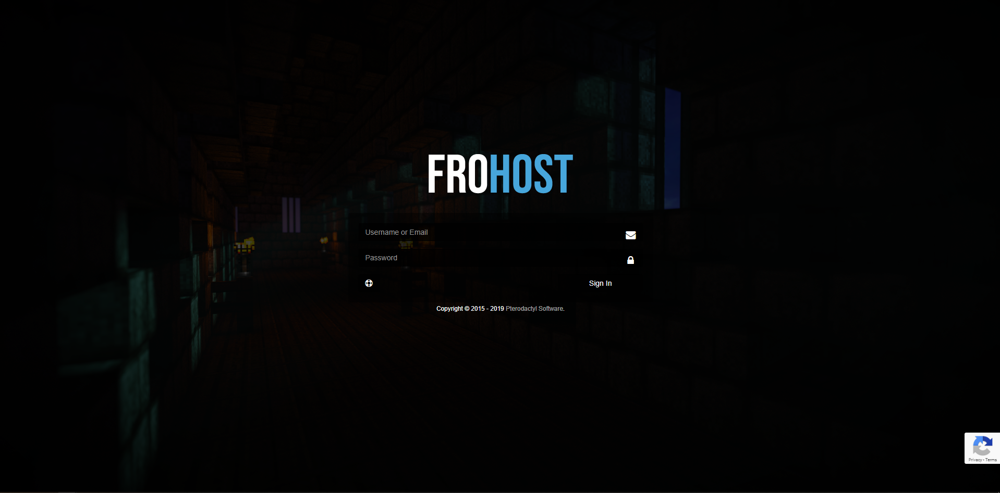
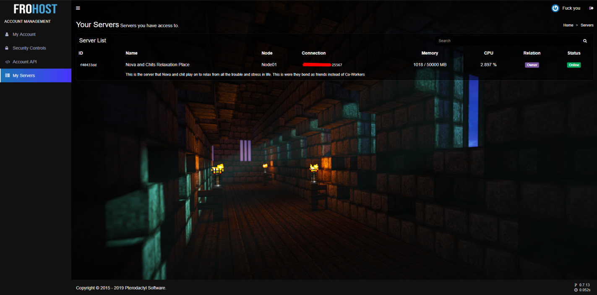
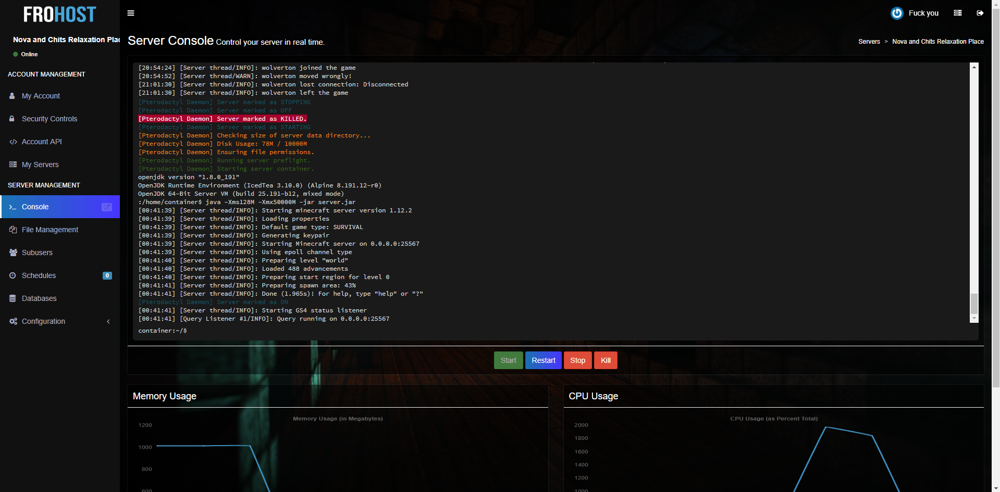
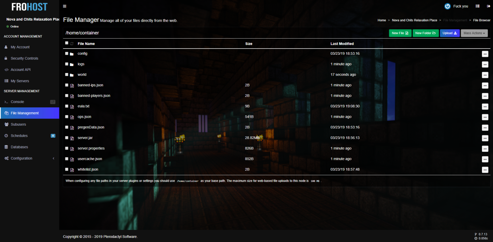

# Chitter-Theme For Pterodactyl

<h2>Welcome To Chitter-Theme</h2>
Thank You for your interest in my theme!

Chitter-Theme is a beautiful dark transparent theme for the most popular game hosting panel Pterodactyl.

<h4>Do I have Permission To use it?</h4>

 Your welcome to use or even modify the theme just please give credit where credit is due.

<h4> Versions (V 0.7.17) </h4>

 Make sure your installing this theme to the right version. I don't offer support for version mismatching

<h4>What if I want to change the background?</h4>

 You can easily change the background by navigating over to `\public\themes\pterodactyl\images`.

<h4>How Do I Install It?</h4>

	1. Download the extract the files on your computer.
	2. Upload your files to you pterodactyl panel web installation area.
	3. Enable the theme in pterodactyl and enjoy.

<h2> Images </h2>

<h4> Login Page </h4>

<h4> Servers Page </h4>

<h4> Rcon Page </h4>

<h4> SFTP Page </h4>

